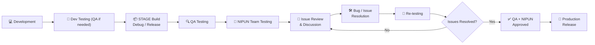

# NIPUN App Releases

Central release index for the **NIPUN Android Application** across DEV, STAGE, and PROD environments. 

> APK files are stored on Google Drive. This repository tracks the latest distributed builds and release notes.

### Play Store

[Download NIPUN App from Google Play Store](https://play.google.com/store/apps/details?id=com.nipun&hl=en_IN)

---

## Current Releases

| Environment | Version | Build | Release Type | Build Date | Status | APK |
|---|---|---|---|---|---|---|
| 🔵 **DEV** | `1.7.5` | `10067` | Release | 05 Oct 2026 | 🧪 Development | [⬇️ Download](https://drive.google.com/file/d/1bxwQAMt9u5X8dEl2_ESimcQKXvccquLJ/view?usp=drive_link) |
| 🟠 **STAGE** | `1.7.5` | `10067` | Release | 05 Oct 2026 | 🔍 Testing | [⬇️ Download](https://drive.google.com/file/d/1_6fMhYKAbsSnb4CoampryVNnSgxH8dsv/view?usp=drive_link) |
| 🟢 **PROD** | `1.7.4` | `10065` | Release | 24 Sep 2026 | ✅ Live | [⬇️ Download](https://drive.google.com/file/d/1ZyD6p_wThZPCCpVCJuTj2Pr2_YyIcphM/view?usp=sharing) |

## Release Flow



> **Release rule:** Any issues identified during STAGE testing go through **Review → Resolution → Re-testing** until QA and the NIPUN Team approve the build for production.

---

## Targeted Release

**Source:** 🟠 STAGE  
**Target:** Oct 2nd Week  
**Status:** QA / NIPUN Team Testing

> The approved STAGE build will be promoted to PROD and submitted to the Play Store.

---

## Release Notes

**Environment:** 🔵 DEV + 🟠 STAGE  
**Release Type:** Release Version

#### What's New

- Updated assessment flow
- Improved student progress flow
- Updated assessment-related validations
- Teacher assessment testing

#### Bug Fixes

- Fixed login-related issues
- Fixed assessment submission issues
- General performance improvements

---

## Issue Reporting - Linear

Include the following when reporting an issue:

```text
Environment:
App Version:
Build Number:
Device:
Android Version:

Issue:
Steps to Reproduce:
Expected Behaviour:
Actual Behaviour:
Screenshot / Video:
```

---

## Developer's Note: Updating a Release

For every new build:

1. Upload APK to Google Drive.
2. Update the corresponding row in **Current Releases**.
3. Update **Current Release Notes** if required.
4. Update **Next Play Store Release** when the STAGE build becomes a release candidate.
5. Commit and push.

```bash
git add README.md
git commit -m "(version - date): release/debug update"
git push
```

---

**Maintained by:** VOPA Technology Team  
**Last Updated:** 05 Oct 2026
