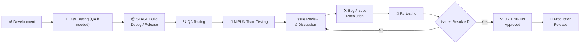

# NIPUN App Releases

Central release index for the **NIPUN Android Application** across DEV, STAGE, and PROD environments. 

> APK files are stored on Google Drive. This repository tracks the latest distributed builds and release notes.

### Play Store

[Download NIPUN App from Google Play Store](https://play.google.com/store/apps/details?id=com.nipun&hl=en_IN)

---

## Current Releases

| Environment | Version | Build | Release Type | Build Date | Status | APK |
|---|---|---|---|---|---|---|
| 🔵 **DEV** | `1.7.52` | `10069` | Debug | 22 Oct 2026 | 🧪 Development | [⬇️ Download](https://drive.google.com/file/d/1Hvg-bOoWCTnd2ivi5U4C-aBOB_bnFq1T/view?usp=sharing) |
| 🟠 **STAGE** | `1.7.52` | `10069` | Release | 22 Oct 2026 | 🔍 Testing | [⬇️ Download](https://drive.google.com/file/d/115tRYWWdAadl9DgUCnrVNbzipAKceKfG/view?usp=sharing) |
| 🟢 **PROD** | `1.7.51` | `10068` | Release | 12 Oct 2026 | ✅ Live | [⬇️ Download](https://drive.google.com/file/d/1395_UtfKOHPKAcYEBDh0kqr0_ipfRgsL/view?usp=sharing) |
| 🟣 **ESDS** | `1.7.53` | `10070` | Release | 24 Oct 2026 | 🧪 Development | [⬇️ Download](https://drive.google.com/file/d/1SJw-K9aqi2Wg4xtFY3gVUxMLNGahwaFc/view?usp=drive_link) |


## Release Flow


```mermaid
flowchart LR
    A["💻 Development"] --> B["🧪 Dev Testing (QA if needed)"]
    B --> C["📦 STAGE Build<br/>Debug / Release"]
    C --> D["🔍 QA Testing"]
    D --> E["👥 NIPUN Team Testing"]
    E --> F["💬 Issue Review<br/>& Discussion"]
    F --> G["🛠️ Bug / Issue<br/>Resolution"]
    G --> H["🔄 Re-testing"]
    H --> I{"Issues Resolved?"}

    I -- "No" --> F
    I -- "Yes" --> J["✅ QA + NIPUN<br/>Approved"]
    J --> K["🚀 Production<br/>Release"]
```

> **Release rule:** Any issues identified during STAGE testing go through **Review → Resolution → Re-testing** until QA and the NIPUN Team approve the build for production.

---

## Targeted Release

**Source:** 🟣 ESDS  
**Target:** Oct 2nd Week  
**Status:** QA / NIPUN Team Testing

> The approved STAGE build will be promoted to PROD and submitted to the Play Store.

---

## Release Notes

**Environment:** 🟣 ESDS
**Release Type:** Release Version

#### What's New

- ESDS BASS_URL change

#### Bug Fixes

- 

#### Features To Be Tested

**Headmaster**

- Everything

**Teacher**

- Everything

**Parent**

- Everything

**Admin**

- Everything

#### Features Not To Be Tested

**All Roles**

- Images might not load as CDN still need to be setup on the ESDS infra.

---

## Issue Reporting - Linear

Include the following when reporting an issue:

```text
Environment:
App Version:
Build Number:
Device:
Android Version:

Issue:
Steps to Reproduce:
Expected Behaviour:
Actual Behaviour:
Screenshot / Video:
```

---

## Developer's Note: Updating a Release

For every new build:

1. Upload APK to Google Drive.
2. Update the corresponding row in **Current Releases**.
3. Update **Current Release Notes** if required.
4. Update **Next Play Store Release** when the STAGE build becomes a release candidate.
5. Commit and push.

```bash
git add README.md
git commit -m "(version - date): release/debug update"
git push
```

---

**Maintained by:** VOPA Technology Team  
**Last Updated:** 08 Oct 2026
